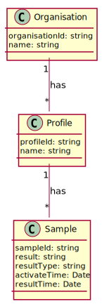

# Test Service

A micro service that manages organisations' test results. We have abstracted other aspects such as authentication.



Above shows the entity relationship between an organisation (`organisation`), its users (`profile`) and their test results (`sample`)
# Local Development
## Prerequisites
* node v10
* npm
## Instructions
* `npm ci` -- Install dependencies
* `npm run watch` -- Watch 
* `npm run build` -- Build
* `npm run test` -- Test
* `npm audit` -- Audit
* `npm run dev` -- Run locally as node process, note that a local postgres instance must be set up and its hostname must be updated at `src/resource/api.json` (`docker-compose up -d --build postgres` brings up only the empty postgres container)

API format follows JSON:API (https://jsonapi.org/)
### Create a profile
```
curl --location --request POST 'http://localhost:8080/test/v1.0/org/84298aa5-27a9-4d54-a357-d8cbe174bb39/profile' \
--header 'Content-Type: application/json' \
--data-raw '{
    "data": {
        "type": "profile",
        "attributes": {
            "name": "John Wayne"
        }
    }
}'
```

### Read a profile
```
curl --location --request GET 'http://localhost:8080/test/v1.0/org/84298aa5-27a9-4d54-a357-d8cbe174bb39/profile/c072284e-eb1f-4294-b06c-26c010a3b4eb'
```

### Add a sample
```
curl --location --request POST 'http://localhost:8080/test/v1.0/org/84298aa5-27a9-4d54-a357-d8cbe174bb39/profile/c072284e-eb1f-4294-b06c-26c010a3b4eb/sample' \
--header 'Content-Type: application/json' \
--data-raw '{
    "data": {
        "type": "result",
        "attributes": {
            "sampleId": "12345678",
            "resultType": "rt-pcr"
        }
    }
}'
```

### Read a sample
```
curl --location --request GET 'http://localhost:8080/test/v1.0/org/84298aa5-27a9-4d54-a357-d8cbe174bb39/profile/c072284e-eb1f-4294-b06c-26c010a3b4eb/sample/12345678'
```

# Docker Deployment
## Prerequisites
* Docker (https://docs.docker.com/get-docker/)
* Docker Compose (https://docs.docker.com/compose/install/)
## Instructions
* `docker-compose up -d --build` -- Build and set up swagger, postgres and service
* `docker-compose down --rmi all` -- Shutdown and clean up
* Go to `http://localhost:9080/swagger/` to interact with APIs

