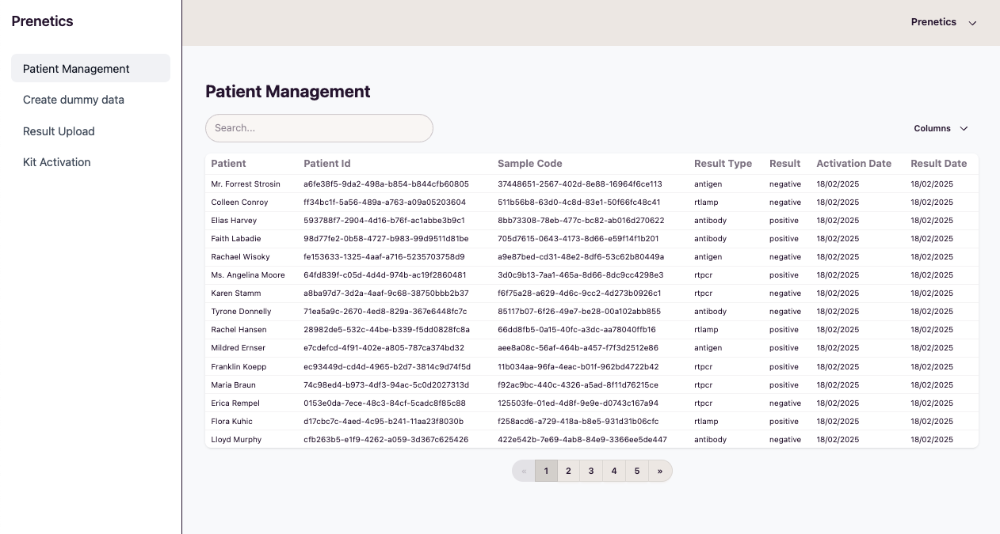
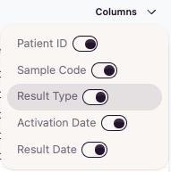

# Prenetics Frontend Engineering Challenge

This repository contains the solution and documentation for the frontend engineering challenge.
It is a single page application that displays a list test results for patients.

It supports:

- Organisation switching
- Column configurations
- Dummy data generation (for easier testing)

The project is based on Vite, React, Tailwind CSS, React Query, and React Router.
It uses [daisyui](https://daisyui.com/) basic styling and components (pure css framework).



## Notes on implementation

### Time constraints

Due to time constraints, testing has only been added to one file as an example of how tests can be written.
More information on testing can be found in the [Testing](#testing) section.

### Features

The requirements of the challenge specified that one organisation should have different columns than the other.
However, given that the implementation is generic and could support multiple organisations, it did not feel appropriate to hardcode the columns for each organisation anywhere.

As an alternative solutions, a column configuration widget was added to the UI to allow users to select the columns they want to see.
Those are saved per-organisation in the browser's local storage to allow different organisations to have different configurations.



## Getting Started

### Prerequisites

This project assumes the prenetics-backend-assignment project is running locally.
If it is not, please follow the instructions in the [prenetics-backend-assignment README](../prenetics-backend-assignment/README.md) to set it up.

The server should be running on `http://localhost:8080`.

### Running the project

To get started with the project, follow these steps:

1. **Go into the directory**

   ```sh
   cd prenetics-frontend-assignment
   ```

2. **Install dependencies:**

   ```sh
   npm install
   ```

3. **Run the development server:**
   ```sh
   npm run dev
   ```

## Testing

### Typical approach to front-end testing

As there was not enough time for me to write tests for the entire application, I will describe the typical approach I would take to testing a front-end application.
Front end testing is typically divided into 2 paradigms:

- **(1) Browser tests** - These are tests that run in a real browser and interact with the application as a user would.
- **(2) Unit/Integrations tests** - These are tests that run in a node environment and test individual functions or components in isolation.

My preference is usually to have a mixtures of both types of tests to ensure that the application is working as expected. But given the overhead of setting up browser tests, I would usually start with node-based tests first.

Apart from the usual unit tests, things I would typically test in a front-end application include:

- **(1) Key user interactions**: I would write tests to ensure that components render correctly and that they respond to user interactions as expected.
- **(2) Data fetching**: I would write tests to ensure that data fetching is working as expected. This include testing that:
  - The "service" or "hook" is calling the correct endpoint
  - The components are actuallty calling the service or hook
- **(3) Error handling**: Injecting some errors into tests allows us to test:
  - Proper redirections
  - Error messages to users
- **(4) State management**: When using state management solutions, I would put some guardrails around it to verify that:
  - The state is being updated correctly
  - The components are reacting to state changes as expected

### Levels of mocking

Assuming we have a component that uses a hook, that in turn calls a service. There are typically 3 options for mocking:

- **Mocking the service**: This is done to ensure that the hook is calling the service implementation (e.g. with `vi.spyOn`)
- **Mocking the hook**: This is done to ensure that the component is calling the hook (e.g. with `vi.spyOn`)
- **Mocking the http layer**: This is done to ensure that the service is calling the correct endpoint (e.g. with `nock`)

Although each may serve a purpose, I generally prefer (if possible) to mock at an http layer as it allows more coverage and more app components to be included in the test.

### Running the tests

To run the tests, use the following command:

```sh
npm run test
```

## Key Technologies

- **Vite**: A fast build tool and development server.
- **Vitest**: A Vite-native unit test framework.
- **React**: A JavaScript library for building user interfaces.
- **Tailwind CSS**: A utility-first CSS framework.
- **React Query**: A library for fetching, caching, and updating asynchronous data in React.
- **React Router**: A library for routing in React applications.
