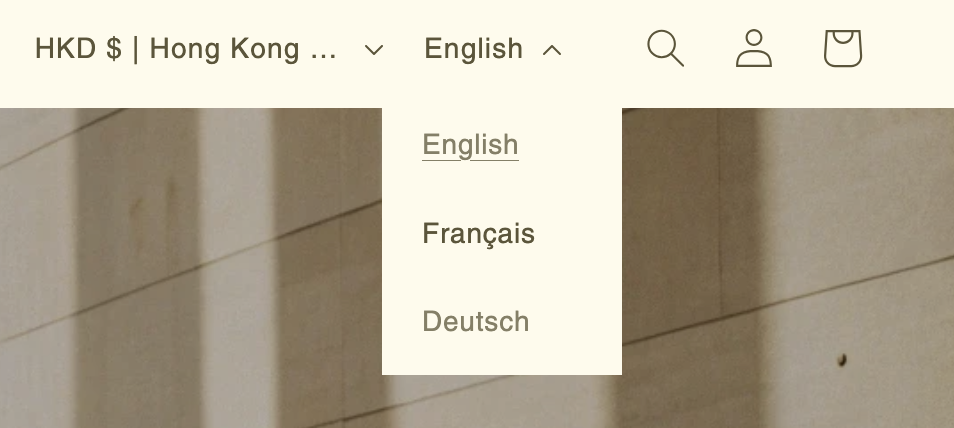

# Shopify Implementation

This page documents the implementation and design decisions for the Shopify store requested by the engineering challenge.

## Name and design

For the appearance of the store, the following criteria were considered:

- The limited amount of content due to time constraints and dummy data:
  - Small size of catalog
  - Limited number of pages
  - Limited number of blog posts
- The theme of the store: Health and Wellness

As a result, I decided to opt for a minimal look with earthy tones and a focus on the products.
The store was named "**Terra**" to reflect the theme of health and wellness.

> Note: AI tools were used to create the dummy data for the site

## Layout

## Native Shopify Store vs Custom Store

There are two primary pathways to building a Shopify storefront:

- **Native Shopify Store**: Using the Shopify platform and tools to build the store.
- **Custom Store**: Building a custom store from scratch using a technology stack of choice (React/Hydrogen/etc)

For this challenge, the **Native Shopify Store** approach was chosen for the following reasons:

- **Feature alignment**

  - The requirements of the challenge were well-aligned with the features provided by Shopify.

- **Time efficiency**:

  - Given time constraints, and having other parts of the challenge to complete, using the native tools provided by Shopify was the most efficient way to build the store.

- **Deployment**:

  - Using a native shopify store offers an already deployed site which would not require custom deployment solutions.

- **Customization**:
  - The native ability of the store to customize themes and even edit layouts was deemed more than sufficient for the requirements of the challenge.

## Content

The store was populated with dummy data in the following ways:

- Products
- Blog Posts
- Pages (About, Contact)

The home page exposes the featured products, user reviews, and a link to access the blog posts.

## Localisation

For efficiency, the store content was written in English. A plugin for localisation can be added to the store to support multiple languages (limited to 2 extra languages).
Although this works well for a fast prototype, it lacks the quality (and proofing) of custom translations.

After the auto-translation, a quick manual review of the translations was made to improve accuracy.

Users can select their preferred language from a dropdown menu in the header.

## Regional Setup

The store is configured as being located in Hong Kong. With a secondary "International" region for other countries.

Upon visiting the site, users are automatically redirected to the appropriate region and language based on their browser settings and location.

Currency is displayed across the site using the user's local (or preferred) currency.

## Custom Shipping Options

The store was configured with a few custom shipping options to simulate a real-world scenario:

- Local (Hong Kong)
  - Default (Free)
  - Special Next Day Delivery (HK$30hkd)
- International Shipping
  - Standard Shipping (HK$11)
  - Express Shipping (HK$23)
  - Orders over HK$1000: Free Shipping

These rules are implemented using Shopify's built-in shipping configuration.

## Discounts

- The store offers a discount code for first-time users. The code `TERRAWELCOME` code provides a 10% discount on the first order
- Shipping discounts are also available for orders over HK$1000
